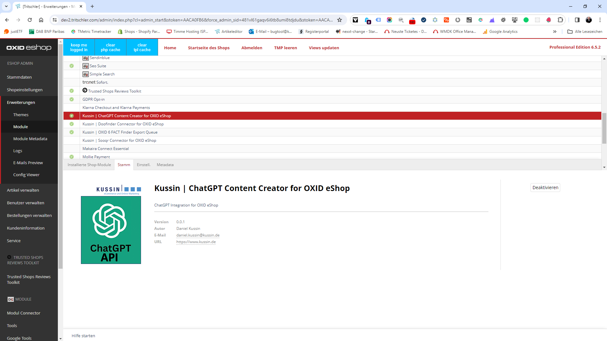
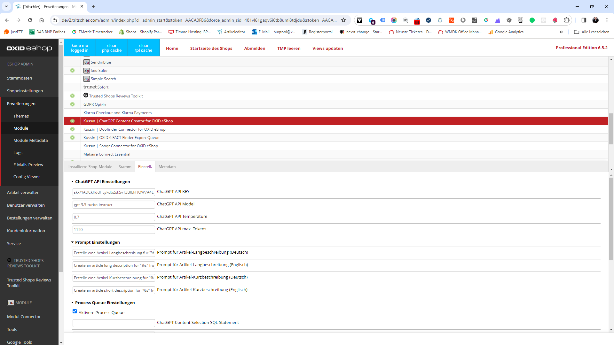
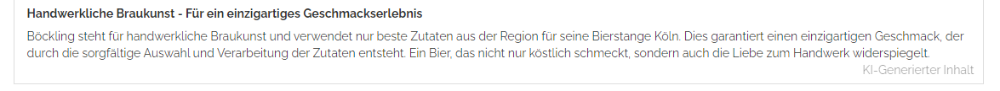
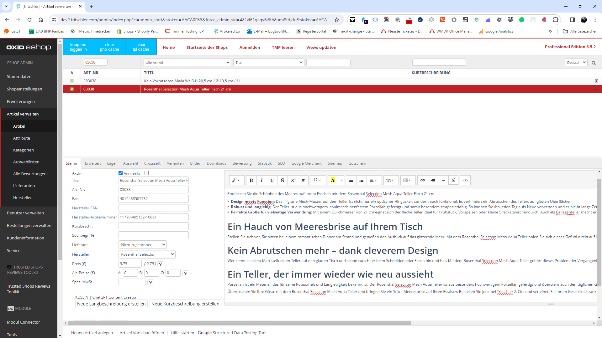

# Kussin | ChatGPT Content Creator for OXID eShop



Kussin | ChatGPT Content Creator for OXID eShop generates Content for Articles, Categories, Manufacturer and Vendors
based on provided data with the help of [ChatGPT](https://chat.openai.com/).<br>
The module comes with predefined Prompts for each type of Content, but you can also create your own Prompts inside the
OXID eShop Admin Panel.

Besides the recommended [Process Queue](https://github.com/kussin/OxidChatGptContentCreator/blob/dev/USER_GUIDE.md#process-queue), 
it's also possible to generate Content directly inside each Content Type. Currently two options are available:

* **Create new Long Description**, which will generate a new Long Description based on the provided data (e.g. Object Title).
* **Create new Short Description**, which will generate a new Short Description based on the provided data (e.g. Object Title).

**NOTE:** The module requires a valid [OpenAI Subscription](https://platform.openai.com/) to work.

Btw. [Kussin | ChatGPT Content Creator for OXID eShop](https://github.com/kussin/OxidChatGptContentCreator) 100% supports
[Kussin | OXID 6 FACT Finder Export Queue](https://github.com/kussin/OxidFactFinderExportQueue), which allows you to 
easily integrate [FACT Finder](https://www.fact-finder.de/), [Sooqr](https://www.sooqr.com/) and [Doofinder](https://www.doofinder.com/) 
into your OXID eShop.

## Module Settings



**NOTE:** By default, the module uses the [OpenAI Model](https://platform.openai.com/docs/models) [`gpt-3.5-turbo-instruct`](https://platform.openai.com/docs/models/gpt-3-5)
but you can change it to any other Model in the Admin Panel.

To change any of the following settings, goto **OXID 6 Admin > Module > ChatGPT Content Creator > Settings Tab > Section "ChatGPT API Settings"**.

1. **ChatGPT API KEY**, must be created at [OpenAI API Keys Portal](https://platform.openai.com/api-keys)
2. **ChatGPT API Model (Default: `gpt-3.5-turbo-instruct`)**
3. **ChatGPT API Temperature (Default: `0.7`)**
4. **ChatGPT API max. Tokens (Default: `350`)**

### General Configuration

#### Prompt Settings

To optimize the ai results goto **OXID 6 Admin > Module > ChatGPT Content Creator > Settings Tab > Section "Prompt Settings"**
and adjust the following settings to your needs.

TODO: Will follow soon

#### Frontend Settings (Disclaimer)



Any generated Content will be marked with a [Disclaimer by default](https://github.com/kussin/OxidChatGptContentCreator/blob/dev/modules/kussin/chatgpt-content-creator/sql/disclaimer.sql), which informs the user that the Content was generated
by ChatGPT. - Please compare the [Module Disclaimer](https://github.com/kussin/OxidChatGptContentCreator?tab=readme-ov-file#disclaimer-for-the-use-of-kussin--chatgpt-content-creator-for-oxid-eshop), too.

To disable or change any of the following settings, goto **OXID 6 Admin > Module > ChatGPT Content Creator > Settings Tab > Section "Frontend Settings"**.

1. **Enable disclaimer (Default: `Enabled`)**
2. **Disclaimer content id (Default: `kussin_chatgpt_disclaimer`)**

**NOTE:** To change the Disclaimer Content, goto **OXID 6 Admin > Customer Info > Visual CMS > CMS content `kussin_chatgpt_disclaimer`**
after enabling the Module.

#### Process Queue Settings

To enable the [Process Queue](https://github.com/kussin/OxidChatGptContentCreator/blob/dev/USER_GUIDE.md#process-queue)
goto **OXID 6 Admin > Module > ChatGPT Content Creator > Settings Tab > Section "Process Queue Settings"** and enable 
Process Queue.<br>
Depending on your Infrastructure and your Catalog, you should adjust the following options to your needs:

1. **ChatGPT API Model (Default: `gpt-3.5-turbo-instruct`)**
2. **ChatGPT API Temperature (Default: `0.7`)**
3. **ChatGPT API max. Tokens (Default: `350`)**
4. **Max. data rows to create prompts (Default: `10`)**
5. **Max. data rows to generate ai content (Default: `1`)**
6. **Max. data rows to replace with ai content (Default: `10`)**

##### ChatGPT Content Selection SQL Statement

To fill the Process Queue with data goto **OXID 6 Admin > Module > ChatGPT Content Creator > Settings Tab > Section "Process Queue Settings"**
and adjust the **ChatGPT Content Selection SQL Statement** to your needs. - By default, the module will automatically add
all Articles to the Process Queue, which have a shorter long description than 250 characters.

**Default SQL Statement:**

```sql
SELECT DISTINCT 
    'oxartextends' AS `object`,
    oxartextends.OXID AS `object_id`,
    'oxlongdesc' AS `field`,
    oxarticles.OXSHOPID AS `shop_id`,
    0 AS `lang_id`,
    'pending' AS `status`
FROM oxartextends
LEFT JOIN 
    oxarticles 
ON 
    (oxartextends.OXID = oxarticles.OXID)
WHERE 
    (oxarticles.OXPARENTID = '')
  AND (LENGTH(oxartextends.OXLONGDESC) < 250)
ORDER BY 
    oxarticles.OXTIMESTAMP DESC;
```

FYI: You can add any other Content Type to the Process Queue, by simply adding a new SQL Statement you only have to ensure
that the result contains the following columns:

* `object` - The Content Type (e.g. `oxartextends`)
* `object_id` - The Content ID (e.g. `OXID`)
* `field` - The Content Field (e.g. `oxlongdesc`)
* `shop_id` - The Shop ID (e.g. `OXSHOPID`)
* `lang_id` - The Language ID (e.g. `0`)
* `status` - The Status (e.g. `pending`)

#### Debug Settings

To enable detailed Logging goto **OXID 6 Admin > Module > ChatGPT Content Creator > Settings Tab > Section "Debug Settings"**
and enable Debug Mode.

TODO: Will follow soon

## Process Queue


The USP of this module is the **Process Queue**, which allows you to create a large amount of Content based on SQL Statements.<br>
The module will simply process in the background 24/7 until the Queue is done. It's also possible that the Process Queue
automatically creates Content for new Articles, Categories, Manufacturer and Vendors, directly after they are created.

### Content Examples



**NOTE:** All examples are Process Queue generated with a Custom Prompt.

* [Article - Long Description](docs/examples/oxartextends_oxlongdesc.html)

### Cron

To process the Process Queue, you have to set up the following Request as Cronjob to your Server:

```bash
curl -i -X GET \
 'https://www.domain.tld/index.php?cl=Process'
```

**RECOMMENDATION:** The Cronjob should be executed every 1 minute.

## Bugtracker and Feature Requests

Please use the [Github Issues](https://github.com/kussin/OxidChatGptContentCreator/issues) for bug reports and feature requests.

## Support

Kussin | eCommerce und Online-Marketing GmbH<br>
Fahltskamp 3<br>
25421 Pinneberg<br>
Germany

Fon: +49 (4101) 85868 - 0<br>
Email: info@kussin.de

## Copyright

&copy; 2006-2024 Kussin | eCommerce und Online-Marketing GmbH